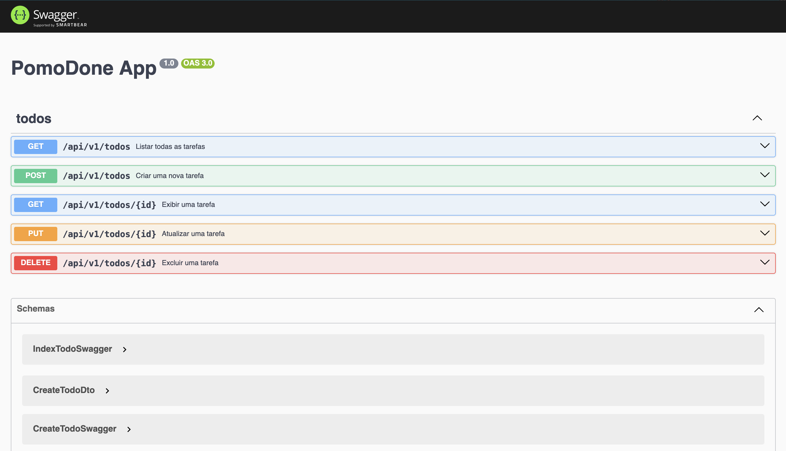

# PomoDone - Pomodoro Timer com To-Do List

**PomoDone** é uma aplicação de gerenciamento de tempo baseada na técnica Pomodoro. Você pode criar tarefas, configurar timers Pomodoro e acompanhar o progresso.

Este projeto está sendo desenvolvido em **NestJS** para estudos pessoais. Esse repositório se trata do **backend** da aplicação e utiliza o **MariaDB** como banco de dados.

Estou utilizando o material do **[Leobritob](https://www.youtube.com/@leobritob)** como referência.



## Como Rodar o Projeto

1. Clone este repositório.
2. Configure o arquivo **`.ENV`**, utilizando o arquivo **`.ENV.EXAMPLE`** como modelo.
3. No terminal, execute os seguintes comandos:

   ```bash
   npm install

   # development
   npm run start

   # watch mode
   npm run start:dev

   # production mode
   npm run start:prod
   ```

4. Para acessar a documentação Swagger, abra o navegador e acesse: `http://localhost:{porta}/swagger`

5. Para executar os testes unitários, execute o seguinte comando:

   ```bash
   npm run test
   ```

### Sugestão para configuração do Banco de Dados:

1. Com o Docker instalado digite:

   ```bash
   docker run --name pomodone-database -p 3306:3306 -e MARIADB_ROOT_PASSWORD=123 -d mariadb:latest
   ```

2. Crie um database com o nome `todo` no banco de dados.
3. O TypeORM irá criar as estruturas.
